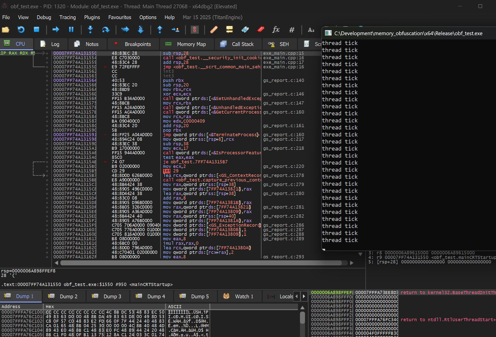
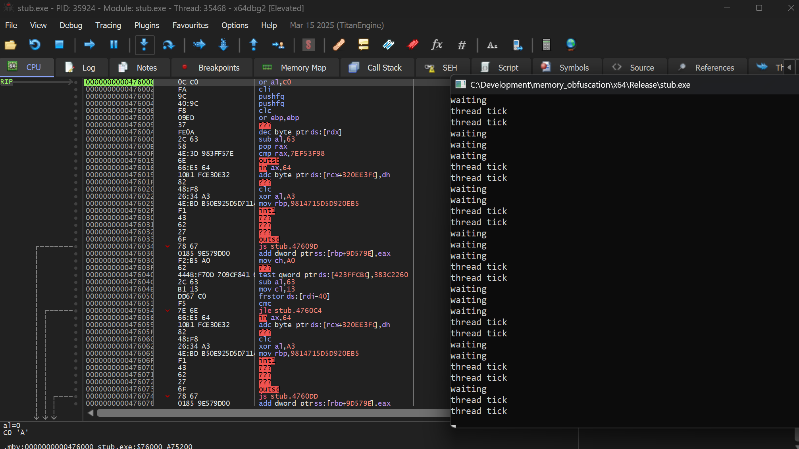
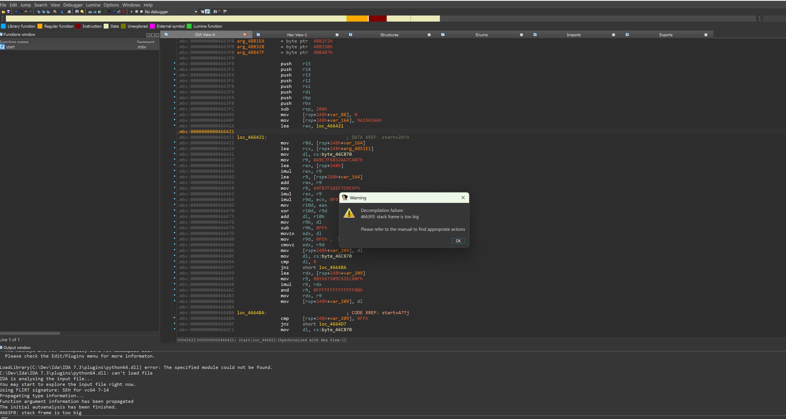
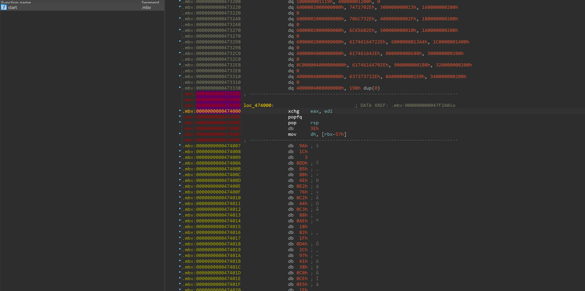

# KUID Shield – PE Obfuscator (Instant re-encryption without watchers)

KUID Shield is a custom obfuscator that provides advanced protection for Windows PE files.  
It encrypts executable sections, enforces strict page access with `PAGE_NOACCESS`, and decrypts only through **KiUserExceptionDispatcher**, pages are also instantly rencrypted once execution is finished — making reverse engineering and dumping nearly impossible.  

The system corrupts headers, resolves and destroys TLS/SEH, performs continuous self-integrity checks, and hides the real entry point behind obfuscated control flow. Invalid memory access attempts permanently corrupt the decryptor, breaking analysis attempts.  

The final result is a **stub executable** (`stub.exe`) containing only encrypted pages, with all original plaintext irrecoverably destroyed.  

---

## 🔒 Features

- **Section Encryption & Protection**  
  Executable sections encrypted and marked `PAGE_NOACCESS`, decrypted only via KiUserExceptionDispatcher and then re-encrypted after execution.  

- **Pre-mapping & Header Corruption**  
  Relocations fixed at a fixed base, headers deliberately corrupted, TLS destroyed, SEH rebuilt, function entries re-registered.  

- **Self-Integrity Validation**  
  Runtime validation ensures no tampering of code pages or the dispatcher itself.  

- **Obfuscated Entry Point**  
  Real OEP hidden behind a fake entry filled with junk code and obfuscated control flow.  

- **Anti-Dumping Protection**  
  Memory access is validated; invalid access attempts irreversibly corrupt the decryptor.  

- **Final Stub Generation**  
  Produces a `stub.exe` with only encrypted pages. No recoverable plaintext sections remain.
  
- **Multi-threading support**  
  Multithreading is fully supported — as shown by the “waiting” log in the console screenshot. Pages are safely decrypted and re-encrypted with controlled access across multiple threads, coordinated through a fast mutex.
---

## 🖼️ Screenshots

### Original (No Encryption)  
The binary running normally without encryption.  

---

### Encrypted Pages (Instant Re-encryption After Execution)  
Executable sections automatically re-encrypt after use, preventing dumping or live patching.  

---

### Obfuscated Entry Point (Fake Entry)  
The real entry point is hidden behind junk code and obfuscated control flow.  

---

### Fully Encrypted Code in IDA Pro  
IDA Pro fails to analyze due to fully encrypted sections. Reverse engineering becomes impractical.  

---

## 🚀 Summary

KUID Shield demonstrates advanced obfuscation and anti-reversing strategies, combining low-level memory protection with runtime encryption, anti-dumping safeguards, and deceptive entry flow.  
It is designed as a showcase of **practical binary protection** for portfolio and research purposes.  
